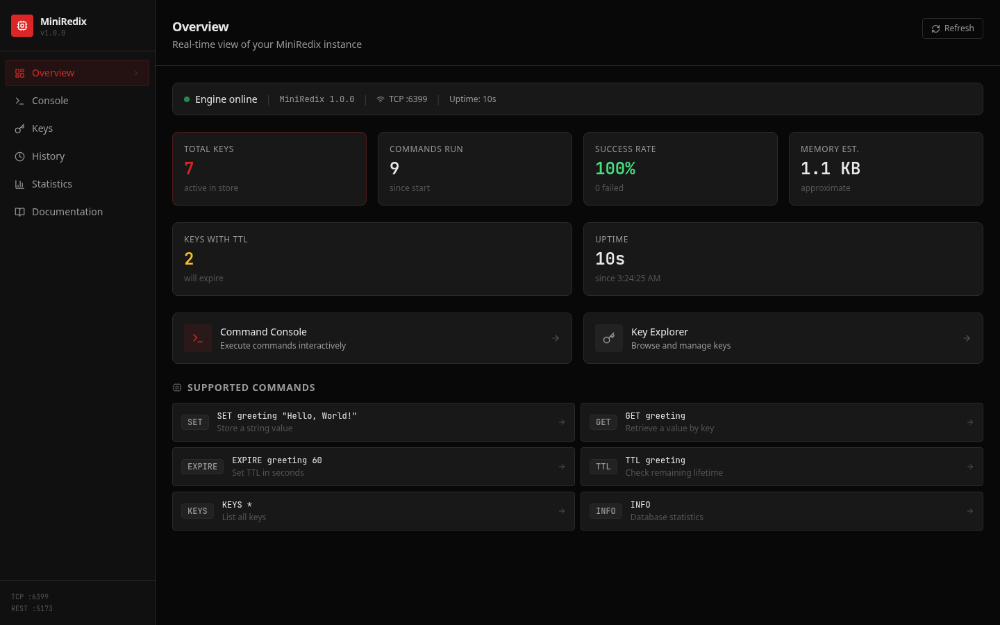
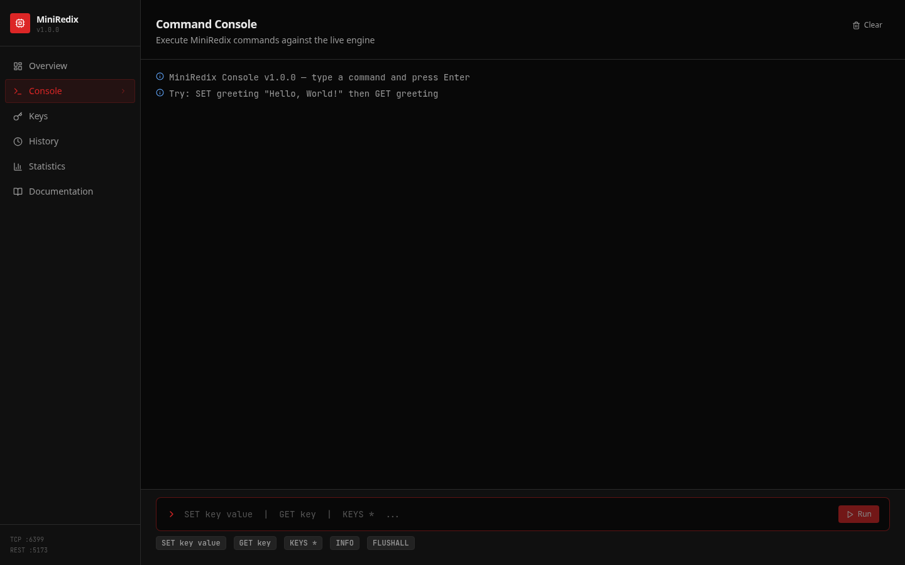
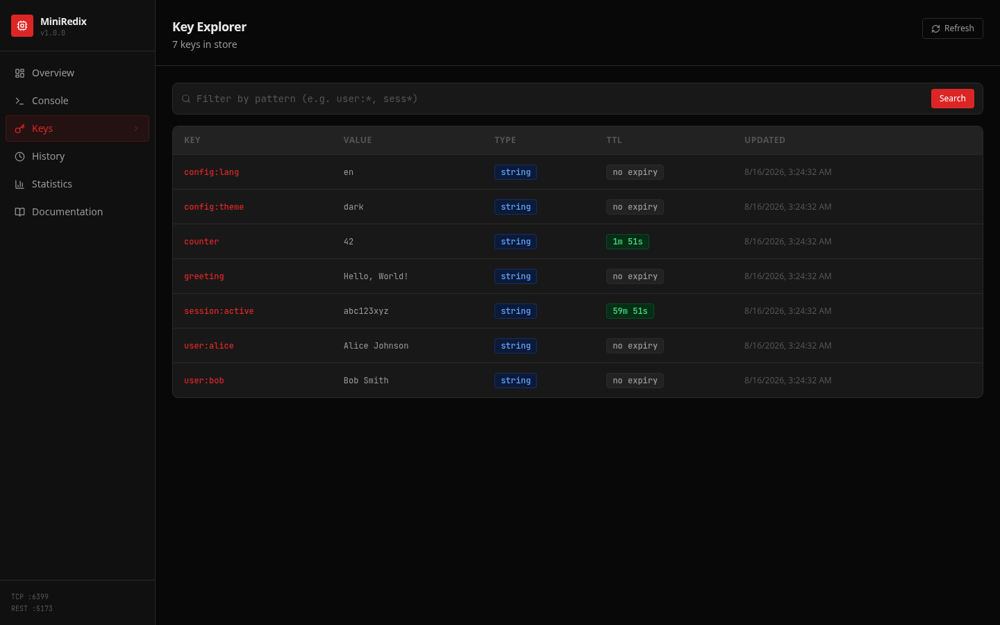
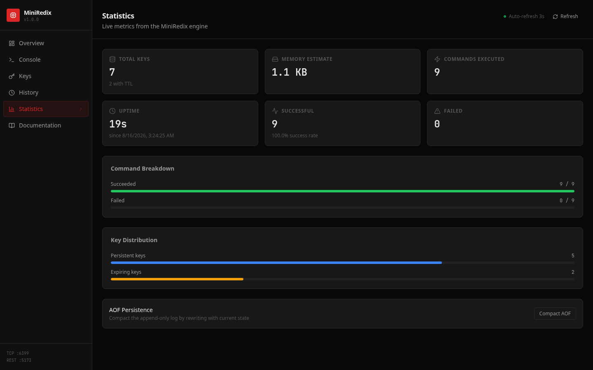

# MiniRedix

A compact Redis-inspired key-value store with a REST API, TCP server, and web dashboard.

## Overview

MiniRedix stores string values in memory and exposes them through a simple command interface. The project includes a browser dashboard for exploring keys, running commands, reviewing history, and monitoring runtime statistics. Mutating commands are persisted to an append-only file so data can be recovered after a restart.

## Screenshots

<p align="center">
  
  
</p>
<p align="center">
  
  
</p>

## Features

- Redis-inspired commands for string values: `SET`, `GET`, `DEL`, `EXISTS`, `KEYS`, `FLUSHALL`, `EXPIRE`, `TTL`, `PERSIST`, `TYPE`, `RENAME`, and `INFO`
- Optional per-key expiration with lazy cleanup
- Append-only file persistence with restart recovery and compaction
- REST API for commands, key management, statistics, health, and history
- Line-based TCP protocol for raw socket clients
- React dashboard with command console, key explorer, history, documentation, and live metrics
- Input validation and rate limiting on the REST API
- Automated unit, persistence, recovery, and HTTP/TCP integration tests

## Tech stack

- TypeScript
- React 18 and React Router
- Vite
- Tailwind CSS
- Express
- Node.js `net`
- Vitest

## Run locally

```bash
npm install
npm run dev
```

The dashboard is available at `http://localhost:5173`. The TCP server listens on port `6399`.

Run the production build with:

```bash
npm run build
```

Run the test suite with:

```bash
npm test
```

## Project structure

```text
src/
├── components/   Shared dashboard UI
├── engine/       Store, command handling, persistence, and TCP server
├── lib/          API client and formatting utilities
├── pages/        Dashboard views
└── server/       Express API and Vite integration

tests/             Unit and integration tests
screenshots/       README screenshots of the dashboard
```
